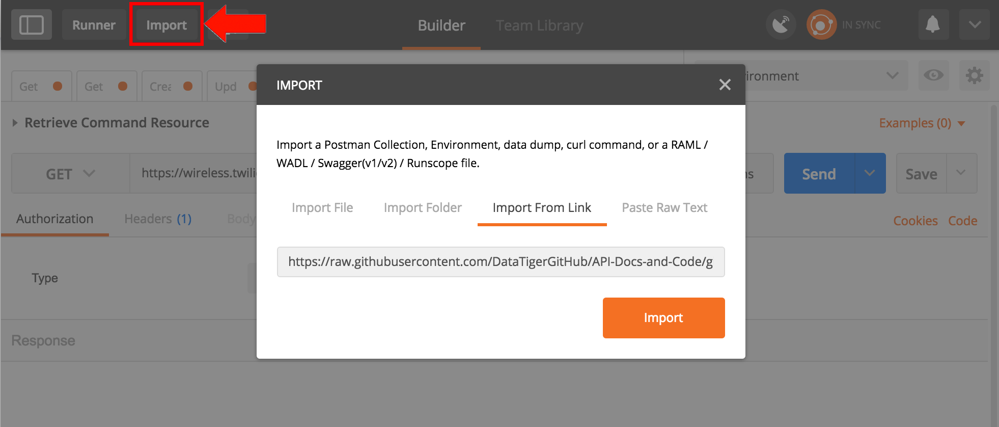

# DataTiger API Postman Collection

With Postman you can test the DataTiger API easily and even generate code snippets for your language of choice.

## What’s Postman?
A powerful GUI platform to make your API development faster and easier, from building API requests through testing, documentation and sharing.

## Where can I get Postman?
[GetPostman.com](https://www.getpostman.com/)

## Importing the DataTiger API as a Postman
Postman collections can be imported in under a minute.
1. Open Postman
2. Click the Import button at the top left of the screen
3. Click the Import From Link button
4. Paste the following url into the input field:
    * https://raw.githubusercontent.com/DataTigerGitHub/API-Docs-and-Code/gh-pages/swagger.yaml 
5. Click the Import button

